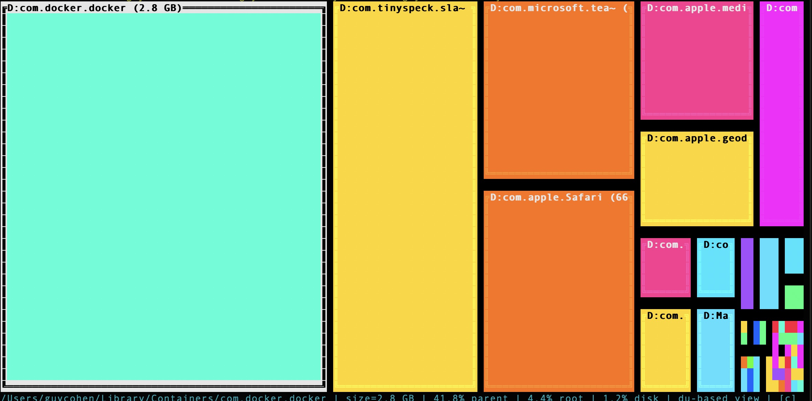

# memblocks

[](https://github.com/guyco3/memblocks/actions/workflows/ci.yml)

memblocks is a macOS terminal disk usage TUI written in Rust.
It renders the current directory as a treemap-like partition where every immediate child (directories and files) is shown proportionally by size.



## Requirements

- macOS
- Rust toolchain (`cargo`, `rustc`)
- UTF-8 terminal
- Optional: `sudo` access for protected paths

## Quick Start

Build:

```bash
cargo build --release
```

Run from source:

```bash
cargo run -- /
```

Run release binary:

```bash
./target/release/memblocks
```

You can replace `/` with any start path, for example:

```bash
cargo run -- ~/Library
cargo run -- /System
```

## Keybindings

- `q`: quit
- Arrow keys: geometric movement between neighboring rectangles
- `j` / `k`: next / previous item
- `Enter` or `l`: enter selected directory
- `h`, `u`, `Backspace`: go to parent directory (works up to filesystem root)
- `c`: copy selected path to clipboard
- `?`: toggle help

## Cache

memblocks stores scan results between runs in:

- `~/Library/Caches/memblocks/cache.json`

On startup/navigation, cached entries are reused only when they are still fresh.
If files/directories were created, deleted, or modified since a snapshot was taken,
the cache entry is invalidated and the directory is scanned again.

## Data Model

- Size source: `du -sk <path>` (or `sudo -n du -sk <path>` when privileged)
- Display unit: bytes (`KB * 1024`)
- Bottom bar:
	- While loading: animated spinner + current path + `items processed: x/?` + disk size
	- When ready: `Ready` + current path + total item count + selected item summary + disk size
- Disk total source: `df -k <root_path>`

## Status Messages

Examples you may see in the bottom bar:

- Loading: `| Scanning /Users/user | Calculating files/dirs... | items processed: 42/? | disk: 926.4 GB | [c] copy path | [?] help`
- Ready: `Ready | /Users/user | items: 187 | selected: /Users/user/Documents (8.3 GB) | disk: 926.4 GB | [c] copy path | [?] help`

## Build And Test

```bash
cargo check
cargo test
```

## Project Layout

- `src/main.rs`: terminal lifecycle and key handling
- `src/app.rs`: application state and navigation behavior
- `src/cache.rs`: persistent on-disk cache loading/saving and freshness validation
- `src/format.rs`: size formatting helpers used by UI/status text
- `src/scanner.rs`: filesystem scanning and watch invalidation
- `src/layout.rs`: rectangle partition algorithm and tests
- `src/ui.rs`: terminal rendering
- `src/actions.rs`: clipboard and sudo auth helpers
- `src/types.rs`: shared data structures

## Contributing

Issues and pull requests are welcome.

Suggested contributor flow:

1. Fork and create a focused branch.
2. Keep behavior changes covered by tests where possible.
3. Run `cargo check` and `cargo test` before opening a PR.
4. Include a clear summary and rationale in the PR description.

## License

MIT. See [LICENSE](LICENSE).
